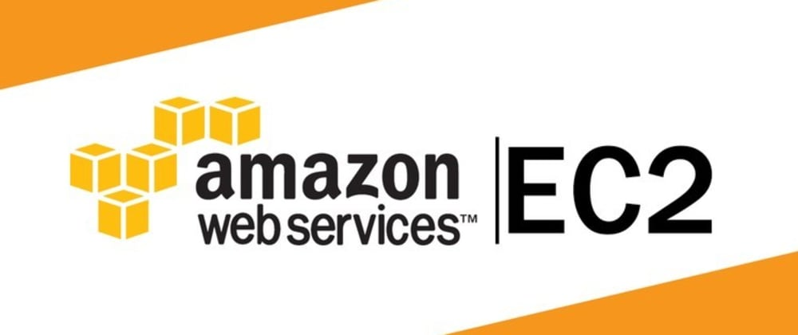

# EC2 Web Server

## Summary
This is my first time using AWS. I've helped out with a website previously, but this is the first time making my own without help. The contents of the web server will improve as I progress in learning Apache, HTML, CSS, and Javascript. The goal is to make a porfolio website with a basic HTML framework then add some CSS and Javascript. I have deployed a t2.micro instance using free tier credits and will be maintaining that as well as this GitHub repository by extension.

## Goal
Obtain an understanding of how to deploy and maintain a web server through an AWS EC2 instance.

## Contents

### Public DNS IPv4

For anyone who wants to see the live EC2 instance, click [here](http://tpham19.ddns.net).

### Tasks (To Be Updated)
* [x] Get an EC2 Instance Running
* [x] Get a Basic HTML Web Server Running
* [ ] Apply CSS Styling
* [ ] Basic Portfolio Website

### User Data
**This is the user data that I had for my EC2 instance at launch.**
```bash
#!/bin/bash
yum update -y
yum install -y httpd
systemctl start httpd
systemctl enable httpd
cd /var/www/html/
echo "Hello, world!" > index.html
```

## Learning Tools Used
### Paid
* ["Amazon Elastic Compute Cloud (EC2) Beginners Certification" Udemy Course by YouAccel](https://www.udemy.com/share/105nzg3@LMUCniwnz79Iz1TTyOcdvDsecSxWE71Oh-1MaSo5RD51toyK8gsXayz2LP08fpTi/)
### Free
* ["HTML & CSS" by Codecademy](https://www.codecademy.com/catalog/language/html-css)
* ["Javascript" by Codecademy](https://www.codecademy.com/catalog/language/javascript)
* ["Javascripting" and "Functional Javascripting" by Node School](https://nodeschool.io/)
* ["Complete Beginner Path" by TryHackMe](https://tryhackme.com/)
* ["Markdown Crash Course" by Traversy Media](https://www.youtube.com/watch?v=HUBNt18RFbo)

## Recommended DNS Services (FREE)
Amazon Route 53 is really easy to connect to an instance. But, the cheapest domaI know is .click and it's $3 a month.

* [No-IP Dynamic DNS](https://www.noip.com/) - This is the one I'm currently using.
    * **Pros:** Dynamic DNS. Easy to use. From what I know, no need for renewal. FREE.
    * **Cons:** 1 Free DNS Per Account. Domains are: .hopto.org, .zapto.org, .sytes.net, and .ddns.net.

* [Freenom](https://www.freenom.com/)
    * **Pros:** Static DNS. Easy to use, configurable to an extent. Renewal every year. FREE.
    * **Cons:** No limit that I'm aware of. Domains are: .tk, .ml, .ga, .cf, and .gq.
**IMPORTANT NOTE: FreeNom is not accepting new Domains currently. Date of Note: 1/24/2023**

## StackOverflow, ServerFault, and SuperUser Threads Used
* **Purpose:** Used as reference for a bash script that pulls new data from the github repository on startup. [here](https://stackoverflow.com/questions/60072643/how-to-automatically-start-execute-and-stop-ec2)
* **Purpose:** Used as reference to modify files in SSH session. [here](https://superuser.com/questions/694450/using-vim-to-force-edit-a-file-when-you-opened-without-permissions)
* **Purpose:** Used as reference to obtain data from github repository. [here](https://serverfault.com/questions/166874/how-do-i-get-curl-to-save-a-file-to-a-specified-directory)

Copyright © 2022 Terry Pham
